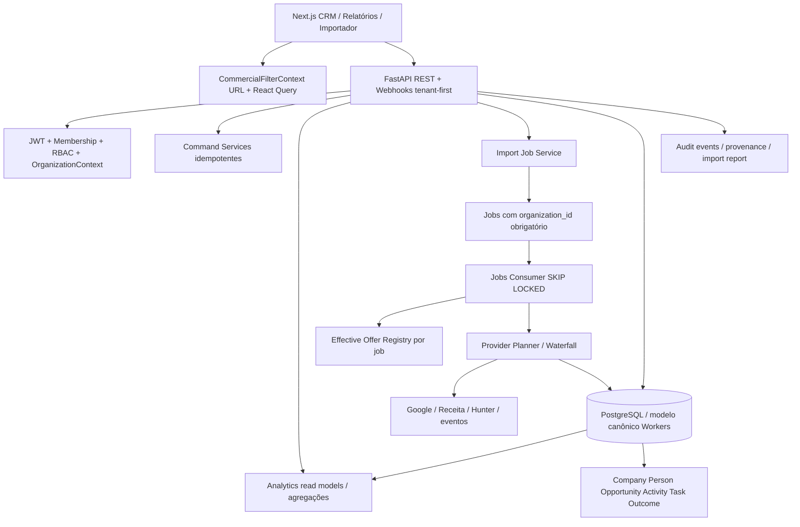
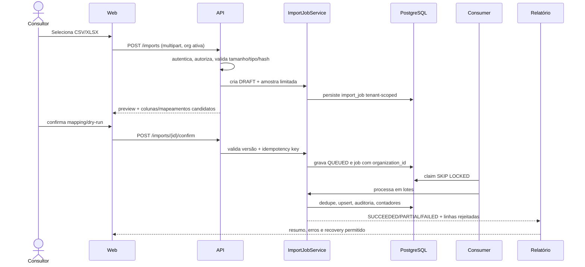
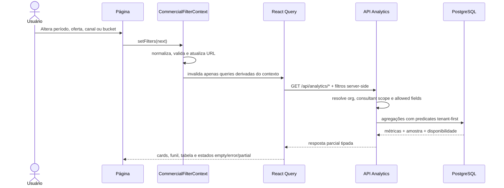
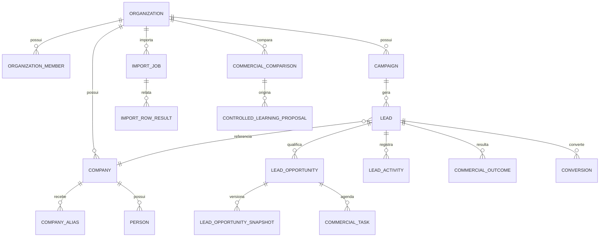

# Design Document: Consolidação da Plataforma Comercial

**Feature:** `consolidacao-plataforma-comercial`  
**Workflow:** design-first  
**Escopo deste artefato:** High-Level Design + Low-Level Design  
**Idioma:** PT-BR  
**Data da auditoria:** sessão atual (pre-flight registrado neste documento)  
**Regra de escopo:** este documento registra desenho, evidências e plano. Nenhum batch B4–B10 é implementado por esta tarefa.

> **Leitura executiva:** a plataforma já possui fundamentos reais de multi-workspace, pipeline, CRM 360, oferta efetiva, discovery, learning controlado e analytics. Ela ainda não deve ser tratada como uma plataforma comercial consolidada: há contratos parciais, caminhos legados, gaps de migration, importação histórica incompleta, analytics sem filtro cruzado, jobs legados sem tenant obrigatório e ausência de UAT comercial sem mocks. A estratégia proposta é incremental, tenant-first e baseada em PRs pequenos.

## Overview

O escopo deste documento é consolidar a plataforma comercial de forma incremental, tenant-first e baseada em PRs pequenos, preservando as fontes canônicas existentes e registrando os gaps de importação histórica, BI cross-filter, CRM operacional, learning observacional, Golden Path, UAT multi-workspace e hardening. Este artefato contém os achados, evidências, diagramas, contratos, gap maps, plano de implementação e Definition of Done; não implementa nenhum batch B4–B10.

### Contexto, pre-flight e método

### 1.1 Pre-flight executado

- Branch confirmada: `main`, alinhada a `origin/main`.
- HEAD registrado: `79eb546845e7bad01d73e2aadb68f852d6c82ad8` (`feat: torna Opportunity 360 editável com RBAC e tarefas idempotentes (#173)`).
- `git fetch --prune origin` executado com segurança; nenhum reset destrutivo foi usado.
- PRs #161–#173 confirmados como `MERGED` via `gh pr list`.
- `graphify-out/graph.json` existe. O CLI indicado em `AGENTS.md` não estava disponível no ambiente: `/tmp/opencode/graphify-venv/bin/graphify` não foi encontrado. Portanto, a presença do grafo foi registrada, mas nenhuma conclusão depende de uma query do CLI.
- `python -m compileall -q services/api services/workers`: passou.
- `python -m pytest tests -q -W error`: `1417 passed, 51 skipped`.
- Frontend: `npm run lint`, `npx tsc --noEmit` e `npm run build`: passaram.
- `alembic heads`: uma cabeça, `e4f5a6b7c8d9`.
- `alembic upgrade head` não foi executado nesta auditoria para evitar mutação de um banco local/compartilhado desconhecido. A execução contra PostgreSQL controlado é gate obrigatório da implementação.
- Working tree ficou limpa antes da criação deste documento; a única alteração esperada nesta tarefa é este arquivo.

### 1.2 Hierarquia de evidências

As conclusões seguem esta ordem: código executado e caminho de request/job; schema e migrations; testes determinísticos; CI; PRs incorporados; documentação marcada como vigente; snapshots históricos. A existência de uma classe, rota ou tabela isolada não é considerada capability completa. `COMPLETE` exige fluxo utilizável, isolamento, persistência, observabilidade e teste proporcional.

### 1.3 Fontes auditadas

Foram consultados `AGENTS.md`, `apps/web/AGENTS.md`, `docs/README.md`, `docs/context.md`, `docs/00-status-mapa.md`, `docs/architecture.md`, `docs/business-rules.md`, `docs/decisions.md`, `docs/roadmap.md`, `docs/roadmap-vendas.md`, `docs/offer-profile.md`, `docs/controlled-learning.md`, `docs/ai-feedback-loop.md`, `docs/hardening-phases-1-6.md`, `docs/uat-runbook.md`, `docs/plano-qualidade-e-bi.md`, `docs/crm-360-gap-map.md`, `docs/pendencias-pos-consolidacao.md`, `docs/consolidacao.md`, `docs/auditoria-frontend.md`, `docs/baseline-operacional.md`, `docs/alphamec-registro.md`, `docs/coding-standards.md`, `docs/agents.md` e `docs/adr/0001-genericity-contract.md`, além dos modelos canônicos, rotas, services, consumer, frontend, migrations, testes e CI descritos nas seções seguintes.

### Executive Summary (máximo aproximado de duas páginas)

A plataforma tem uma base de produto consistente: `Organization` e `OrganizationMember` existem no modelo canônico (`services/workers/src/database/models.py:148`, `:209`); leads, campaigns, companies, people, oportunidades, snapshots, outcomes, comparações, learning proposals, conversions, activities, jobs e notifications são persistidos no mesmo modelo (`models.py:476`, `:578`, `:940`, `:1024`, `:1087`, `:1122`, `:1155`, `:1225`, `:1250`, `:1269`, `:1303`, `:1400`, `:1561`, `:1588`). O caminho de Opportunity 360 já é tenant-scoped e possui tarefas idempotentes (`services/api/src/services/opportunity_command_service.py:89`, `:98`, `:260`; `services/api/src/routes/opportunities.py:63`, `:82`, `:101`, `:120`). O registry efetivo parte de catálogo base e aplica overlay por organização (`services/workers/src/services/prospecting/effective_offer_registry.py:19`), enquanto o runtime usa `ContextVar` por job (`runtime_offer_registry.py:16`). O consumer usa `FOR UPDATE SKIP LOCKED` e rejeita jobs sem organização (`services/api/src/jobs_consumer.py:44`, `:85`, `:104`). Esses fatos sustentam uma consolidação, mas não substituem os gaps abaixo.

O maior risco é declarar produto comercial antes de fechar o fluxo ponta a ponta. O importador existente é um webhook simples: resolve `Campaign` por ID sem `organization_id` (`services/api/src/services/webhook_import_service.py:106`), faz um único commit após o loop e não oferece upload CSV/XLSX, preview, mapeamento, dry-run, job persistido, relatório de auditoria ou recuperação formal. O inbound de e-mail moderno é mais seguro — token por organização em `Organization.inbound_token_hash`, índice único na migration `5b7c9d1e3f4a_add_inbound_token_hash.py` e serviço que exige `organization_id` (`services/api/src/services/inbound_token_service.py:28-66`, `services/api/src/services/inbound_email_service.py:82-99`) — mas o caminho legado ainda exige segredo global + header e a importação não possui o mesmo contrato tenant-first (`services/api/src/routes/webhooks.py:1-21`, `:68-112`).

O BI atual também é um contrato parcial. O serviço usa um funil fixo de cinco estágios (`services/api/src/services/analytics_service.py:90`) e a rota aceita apenas `from_date`, `to_date`, `campaign_id` e `consultant_id` (`analytics_service.py:406`). O cliente web repete esse contrato em `apps/web/src/lib/api.ts:840-844`; não há `offer_key`, canal, atribuição, bucket, outcomes separados, amostra ou disponibilidade. A página de relatórios concentra múltiplos `useQuery`, estado local e loading/error global (`apps/web/src/app/(protected)/relatorios/page.tsx`), o que impede um `CommercialFilterContext` compartilhado e degrada empty/partial/error states em uso operacional.

A ordem recomendada é: (1) contrato tenant-first e schema/migration de jobs, conversões, import jobs e auditoria; (2) B4 em fatias de import seguro; (3) B5 com Filter Context e agregações PostgreSQL; (4) B6 CRM operacional; (5) B7 coaching/calibração observacional; (6) B8 Golden Path com provenance e UAT real; (7) B9 UAT multi-workspace; (8) B10 três campanhas reais e hardening. Não criar Proposal/Contract/Note paralelos: usar as fontes canônicas atuais e adicionar somente lifecycle/estrutura que tenham consumidor real. Não usar Elasticsearch neste estágio, não filtrar o universo inteiro no navegador e não alterar pesos de score silenciosamente.

**Decisão de produto:** a consolidação só será declarada pronta quando um usuário de duas organizações puder executar, sem mocks de sucesso comercial, o caminho evento/lead → entidade canônica → oportunidade → oferta/versionamento → ação → outcome → analytics, enquanto tentativas cross-tenant, jobs concorrentes, imports repetidos, filtros, exports, providers e overlays permanecerem isolados e auditáveis.

## 3. Capability Matrix

Status permitido: `COMPLETE`, `PARTIAL`, `PLACEHOLDER`, `LEGACY`, `DUPLICATED`, `UNSAFE`, `NOT IMPLEMENTED`.

| Capability | Status | Evidência verificável | Gap/decisão |
|---|---|---|---|
| Multi-workspace | PARTIAL | `Organization`/`OrganizationMember` em `models.py:148-235`; header ativo em `apps/web/src/lib/api.ts:67-70` | Falta provar todos os caminhos assíncronos, webhooks, exports e analytics por tenant. |
| Membership e RBAC | PARTIAL | `OrganizationMember` em `models.py:209`; dependencies de auth e RBAC; Opportunity 360 já verifica papel | Matriz precisa ser aplicada uniformemente a import, learning, secrets e bulk actions. |
| `organization_id` isolation | PARTIAL | Leads filtrados por org em `services/api/src/routes/leads.py:400`; Opportunity por `(id, organization_id)` em `opportunity_command_service.py:89` | Há query de `Campaign` sem org em `webhook_import_service.py:106`; jobs permitem NULL em `models.py:1565`. |
| Secrets e quotas | PARTIAL | `organization_secrets` em `models.py:323`; métricas por org em `provider_execution_metric_service.py:82-103` | Estados `disabled`/`quota_exceeded` são agregados como `skipped`; revisar exposição e orçamento. |
| Company | PARTIAL | Modelo em `models.py:940`; resolução em `company_identity_service.py:25` | Falta contrato único de merge, histórico e UI operacional completa. |
| Person | UNSAFE | Modelo em `models.py:1024`; resolução CPF/e-mail/nome em `company_person_service.py:244` | Modelo não possui constraint única suficiente para identidade; nome pode gerar colisão. |
| Aliases | COMPLETE | `CompanyAlias` em `models.py:986`; migration `ff8a9b0c1d2e_company_aliases_cross_provider.py` cria unicidade por org/kind/value | Ainda requer provas negativas cross-tenant e política de revisão. |
| Discovery federado | PARTIAL | planner em `discovery_planner_service.py`; providers e métricas persistidas | Provenance, quotas e estados existem de forma desigual entre providers. |
| People/event discovery | PARTIAL | `Person` e `EventOpportunityRow` (`models.py:1024`, `:1155`); migrations `fb1c2d3e4f5a_add_event_and_outcome_tables.py` | Golden Path FACT/INFERENCE/HYPOTHESIS ainda não é um contrato único. |
| Provider registry/planner | PARTIAL | `effective_offer_registry.py:19`; `runtime_offer_registry.py:16`; planner | Falta um estado operacional uniforme para disabled, quota, empty e failed. |
| Pre-scoring | COMPLETE | `PrescoringDiscard` e índice em `models.py:1350`; testes `test_prescoring_discard_provenance.py` | Capability do gate é real; ainda precisa calibrar falso negativo no B7. |
| Enrichment waterfall | PARTIAL | serviços de enriquecimento e testes de domínio | Deve carregar orçamento, provenance e não transformar ausência em falha. |
| OfferProfile/versionamento | PARTIAL | `effective_offer_registry.py`; docs `offer-profile.md` | Aplicação real no fluxo comercial e rollback precisam de prova por campanha. |
| Registry efetivo | COMPLETE | overlay ativo por org em `effective_offer_registry.py:19`; runtime isolado em `runtime_offer_registry.py:16` | Validar concorrência e ausência de estado global no B9. |
| OfferMatcher | PARTIAL | uso de oferta em oportunidades/outcomes | Falta contrato público de explicação, confidence e fallback. |
| Snapshots | COMPLETE | `LeadOpportunitySnapshot` em `models.py:1122`; histórico exposto em `leads.py` | Garantir snapshot em toda conversão e leitura histórica. |
| LeadOpportunity/attribution | PARTIAL | modelo `models.py:1087`; índice único em migration `f9a0b1c2d3e4_create_lead_opportunities_table.py` | Conversão ainda tem check-then-insert e migration da unicidade de expressão precisa ser confirmada. |
| Next Best Action | PLACEHOLDER | campos de próxima ação e tarefas em Opportunity 360 | Falta regra auditável, priorização por SLA e telemetria de conclusão. |
| Sequences/workflows | PARTIAL | scheduler/cadência e `engagement_service`; testes de engagement | Import/outcome e pausa por canais precisam de contrato único. |
| Kanban | PARTIAL | vendas e status de lead existentes | Estados comerciais, lost reason e bulk transitions ainda têm drift. |
| Feedback de utilidade | COMPLETE | APIs/types e testes de usefulness feedback | Vincular ao contexto de oferta/canal sem misturar feedback de score. |
| Score feedback | PARTIAL | rotas `leads.py` e tipos em `api.ts` | Aplicação opcional existe; governança, bucket e comparação temporal entram no B7. |
| Controlled learning | COMPLETE | `CommercialComparison`/`ControlledLearningProposal` em `models.py:1250-1303`; testes `test_controlled_learning.py`, `test_learning.py` | Capability é controlada; falta UAT de aprovação/publicação/rollback em duas orgs. |
| CRM adapters/sync | PARTIAL | `crm_sync_service.py:159-163`; `test_crm_adapter_contract.py` | Idempotência e tenant dos adapters precisam de provas de retry e conflito. |
| Company/Person/Opportunity 360 | PARTIAL | routes `opportunities.py:63-120`; entities em `models.py` | Company/Person ainda não têm navegação/edição canônica equivalente. |
| Tarefas idempotentes | COMPLETE | `opportunity_command_service.py:260`; `test_opportunity_commands.py` | Preservar chave e `IntegrityError` sob corrida; repetir no import/bulk. |
| RBAC operacional | PARTIAL | dependencies, rotas Opportunity e membros | Fechar matriz por ação e resposta indistinguível para recursos de outro tenant. |
| Timeline | PARTIAL | `LeadActivity` em `models.py:1400`; inbound registra atividade | Falta timeline agregada de Company/Person/Opportunity/Task/Outcome. |
| Import histórico CSV/XLSX | NOT IMPLEMENTED | `tests/test_csv_import.py` cobre caminho existente, mas não há job de upload/preview; `crm_spreadsheet_service.py:111` apenas abre XLSX e anexa leads | B4 deve criar fluxo seguro, não ampliar webhook ad hoc. |
| BI cross-filter | NOT IMPLEMENTED | `analytics.py`/`analytics_service.py:406`; `api.ts:840-844` sem contexto compartilhado | B5. |
| UAT comercial sem mocks | NOT IMPLEMENTED | CI e testes unitários passam; UAT runbook documenta intenção | B9/B10 são gates, não capacidades atuais. |

## Data Models

O gap map abaixo reúne os modelos canônicos, as decisões de schema e as mudanças aditivas propostas. As fontes, evidências, constraints, regras de migration e relações existentes foram preservadas integralmente.

### Data Model Gap Map

### 4.1 Fontes canônicas a preservar

- **Tenant e autorização:** `Organization`, `OrganizationMember`, usuário, secrets e quotas.
- **Identidade:** `Company`, `CompanyAlias`, `Person`; CNPJ/domínio/place_id têm precedência conservadora (`company_identity_service.py:25`).
- **Prospecção:** `Campaign`, `Lead`, discovery candidates/discards e provenance.
- **Comercial:** `LeadOpportunity`, `LeadOpportunitySnapshot`, `CommercialOutcomeRow`, `Conversion`, `CommercialTask`, `LeadActivity`.
- **Oferta e learning:** registry base/efetivo, `CommercialComparison`, `ControlledLearningProposal`.

### 4.2 Gaps e decisões de schema

| Tema | Estado observado | Mudança aditiva proposta | Gate |
|---|---|---|---|
| Job tenant obrigatório | `Job.organization_id` é `nullable=True` (`models.py:1565`) embora `jobs_consumer.py:85` rejeite job sem org | Nova migration expand-compatible: backfill somente por `campaign_id` resolvido de forma tenant-safe, rejeitar órfãos, depois `NOT NULL`; criar índice `(organization_id,status,created_at)` | Verificador de schema, duas execuções de migration, teste de job órfão e corrida. |
| Conversão única | Modelo declara índice de expressão `uq_conversions_lead_offer` (`models.py:1306`); migration correspondente não foi localizada com segurança | Confirmar schema real; se ausente, nova migration PostgreSQL com índice único de expressão após relatório de colisões, sem apagar histórico | Teste de concorrência existente `test_conversion_unique_concurrency.py` contra Postgres. |
| Lost reason | `Lead.lost_reason` é anulável (`models.py:643`) e não foi encontrada migration clara para `ck_leads_lost_reason_required` | Constraint aditiva somente para estados terminais após backfill explícito e revisável; não inventar motivo | Testes de transição e migration verifier. |
| Person identity | CPF/e-mail/nome são resolvidos em serviço (`company_person_service.py:244`), mas não há constraint única de identidade | Índices parciais por org para valores normalizados; merge conservador e tabela de alias/histórico se necessária | Testes de colisão e prova negativa entre orgs. |
| Import job | Não existe entidade de ciclo de vida dedicada | Criar `import_jobs` + linhas/resultados/auditoria com `organization_id`, hash do arquivo, idempotency key, status e error class | Máquina de estados, retry, cancelamento e retenção. |
| Filter Context | Não há snapshot materializado ou contrato de filtro cruzado | DTO versionado e queries server-side; índices somente após `EXPLAIN` de consultas reais | Contrato API/frontend e benchmark por bucket. |
| Timeline | `LeadActivity` existe, mas não cobre toda entidade | Evento append-only ou view union somente quando o lifecycle exigir; não criar `Note` solta sem consumidor | Teste de ordenação, tenant e retenção. |
| Provenance | Eventos possuem source/provenance em partes do modelo | Tipos FACT/INFERENCE/HYPOTHESIS, provider, observed_at, evidence_url e confidence, preservando snapshots | Teste de ausência de evidência e não causalidade. |

**Regra de migration:** nunca reescrever migration compartilhada, preferir expand-compatible, avaliar índice de toda FK/hot path, validar cadeia Alembic e executar backfill idempotente sem inventar dados.

## Architecture

A arquitetura alvo, o fluxo comercial consolidado, as sequências de importação e Filter Context e o modelo conceitual abaixo são os diagramas existentes deste design. As decisões são incrementais e tenant-first; os nomes de endpoints apresentados adiante permanecem contratos de design, não endpoints já implementados.

### High-Level Design

### 5.1 Arquitetura alvo



### 5.2 Fluxo comercial consolidado


### 5.3 Sequência de importação segura



### 5.4 Sequência de Filter Context



### 5.5 Modelo conceitual proposto



## Components and Interfaces

Os componentes e suas responsabilidades estão representados nos diagramas de arquitetura acima e nos procedimentos de baixo nível abaixo: Web/CRM e relatórios, API FastAPI, autenticação e RBAC, command services, analytics, Import Job Service, PostgreSQL canônico, fila/consumer, registry efetivo, planner de providers, provenance e auditoria. Os contratos existentes e propostos da superfície de importação e analytics, incluindo seus DTOs e estados, são mantidos na subseção seguinte.

### Interfaces externas propostas

Todos os endpoints devem resolver `OrganizationContext` antes de carregar qualquer entidade por UUID. Os nomes abaixo são contratos de design, não endpoints existentes.

```pascal
INTERFACE ImportAPI
  POST /api/imports(file, options, idempotency_key) -> ImportPreview
  GET  /api/imports/{import_id} -> ImportJobView
  POST /api/imports/{import_id}/dry-run(mapping, expected_version) -> DryRunReport
  POST /api/imports/{import_id}/confirm(mapping, expected_version, idempotency_key) -> ImportJobView
  POST /api/imports/{import_id}/cancel -> ImportJobView
  GET  /api/imports/{import_id}/rows?status=&cursor= -> ImportRowPage
END INTERFACE

INTERFACE CommercialAnalyticsAPI
  GET /api/analytics/funnel(filters: CommercialFilterDTO) -> FunnelResponse
  GET /api/analytics/outcomes(filters: CommercialFilterDTO) -> OutcomeResponse
  GET /api/analytics/quality(filters: CommercialFilterDTO) -> QualityResponse
  GET /api/analytics/export(filters: CommercialFilterDTO, format) -> ExportJob
END INTERFACE

STRUCTURE CommercialFilterDTO
  organization_id: UUID        // derivado do contexto; não aceito do cliente
  from_date: DateTime?
  to_date: DateTime?
  campaign_id: UUID?
  consultant_id: UUID?
  offer_key: String?
  channel: String?
  status: List[String]
  score_bucket: List[String]
  outcome: List[String]
  assigned: String?
  search: String?
  cursor: String?
  limit: Integer              // teto server-side
END STRUCTURE

STRUCTURE ImportJobView
  id: UUID
  status: DRAFT | PREVIEWED | QUEUED | RUNNING | SUCCEEDED | PARTIAL | FAILED | CANCEL_REQUESTED | CANCELLED
  organization_id: UUID       // nunca confiado do payload
  source_hash: String
  total_rows: Integer
  accepted_rows: Integer
  rejected_rows: Integer
  duplicate_rows: Integer
  error_code: String?
  created_at: DateTime
  completed_at: DateTime?
END STRUCTURE
```

## 6. Low-Level Design

### 6.1 Resolução conservadora de Company e Person

Precedência: identificador forte e normalizado primeiro; alias conhecido depois; nome + contexto somente como candidato; nunca merge automático de duas entidades ambíguas. Toda query começa por `organization_id` e toda mutação verifica que as entidades relacionadas pertencem à mesma organização.

```pascal
ENUM MatchKind
  EXACT_STRONG
  EXACT_ALIAS
  EXACT_CONTEXT
  CANDIDATE_REVIEW
  NOT_FOUND
END ENUM

FUNCTION resolve_company(input, organization_id)
  REQUIRE organization_id IS NOT NULL
  REQUIRE input IS NOT NULL

  normalized_cnpj <- normalize_cnpj(input.cnpj)
  normalized_domain <- normalize_domain(input.domain)
  normalized_place <- normalize_place_id(input.place_id)
  normalized_name <- normalize_text(input.name)

  IF normalized_cnpj IS NOT NULL THEN
    result <- query Company WHERE organization_id = organization_id
             AND normalized_cnpj = normalized_cnpj
    IF result HAS EXACTLY ONE THEN RETURN Match(EXACT_STRONG, result)
    IF result HAS MORE THAN ONE THEN RETURN Match(CANDIDATE_REVIEW, result)
  END IF

  IF normalized_domain IS NOT NULL THEN
    result <- query Company WHERE organization_id = organization_id
             AND normalized_domain = normalized_domain
    IF result HAS EXACTLY ONE THEN RETURN Match(EXACT_STRONG, result)
  END IF

  IF normalized_place IS NOT NULL THEN
    result <- query Company WHERE organization_id = organization_id
             AND place_id = normalized_place
    IF result HAS EXACTLY ONE THEN RETURN Match(EXACT_STRONG, result)
  END IF

  alias <- query CompanyAlias WHERE organization_id = organization_id
          AND alias_value IN (normalized_domain, normalized_place, normalized_name)
  IF alias HAS EXACTLY ONE THEN RETURN Match(EXACT_ALIAS, alias.company)
  IF alias HAS MORE THAN ONE THEN RETURN Match(CANDIDATE_REVIEW, alias)

  context_candidates <- query by normalized_name and compatible location
  IF context_candidates HAS EXACTLY ONE AND confidence(context_candidates[0]) >= REVIEW_THRESHOLD THEN
    RETURN Match(EXACT_CONTEXT, context_candidates[0])
  END IF

  RETURN Match(CANDIDATE_REVIEW, context_candidates)
END FUNCTION

FUNCTION resolve_person(input, organization_id, company_id?)
  REQUIRE organization_id IS NOT NULL

  candidates <- query Person WHERE organization_id = organization_id
  IF company_id IS NOT NULL THEN candidates <- candidates AND company_id = company_id END IF

  email <- normalize_email(input.email)
  cpf <- normalize_cpf(input.cpf)
  name <- normalize_text(input.name)

  IF cpf IS NOT NULL AND unique(candidates by cpf) THEN RETURN EXACT_STRONG
  IF email IS NOT NULL AND unique(candidates by email) THEN RETURN EXACT_STRONG
  IF unique(candidates by name + company_id) THEN RETURN EXACT_CONTEXT

  RETURN CANDIDATE_REVIEW
END FUNCTION
```

**Invariantes:** nenhum resultado fora de `organization_id`; nenhuma fusão destrutiva automática; cada decisão salva regra, identificador usado, confidence, fonte e timestamp; um candidato ambíguo não cria novo registro silenciosamente quando houver conflito.

### 6.2 CommercialFilterContext e tradução SQL

O contexto é compartilhado entre dashboard, relatórios, CRM e export. O navegador mantém apenas estado serializável e pequeno na URL; o universo e as agregações permanecem no servidor. O backend deriva organização e escopo de consultor da sessão, valida enum/limites e compõe predicates com `&`, nunca `and`/`or` de Python.

```pascal
FUNCTION normalize_filters(raw, session)
  org <- require_active_membership(session)
  filters <- parse_allowed_fields(raw)
  filters.limit <- min(filters.limit OR DEFAULT_LIMIT, MAX_LIMIT)
  filters.status <- validate_enum_list(filters.status, LeadStatus)
  filters.channel <- validate_enum_list(filters.channel, AllowedChannel)
  filters.score_bucket <- validate_score_buckets(filters.score_bucket)
  filters.consultant_id <- authorize_consultant_scope(filters.consultant_id, session)
  RETURN filters WITH organization_id = org.id
END FUNCTION

FUNCTION filters_to_sql(filters, session)
  f <- normalize_filters(filters, session)
  predicate <- (Lead.organization_id = f.organization_id)

  IF f.from_date IS NOT NULL THEN predicate <- predicate AND Lead.created_at >= f.from_date END IF
  IF f.to_date IS NOT NULL THEN predicate <- predicate AND Lead.created_at < f.to_date END IF
  IF f.campaign_id IS NOT NULL THEN predicate <- predicate AND Lead.campaign_id = f.campaign_id END IF
  IF f.consultant_id IS NOT NULL THEN predicate <- predicate AND Lead.assigned_to_id = f.consultant_id END IF
  IF f.status IS NOT EMPTY THEN predicate <- predicate AND Lead.status IN f.status END IF
  IF f.offer_key IS NOT NULL THEN predicate <- predicate AND LeadOpportunity.offer_key = f.offer_key END IF
  IF f.channel IS NOT NULL THEN predicate <- predicate AND Activity.channel = f.channel END IF
  IF f.search IS NOT NULL THEN predicate <- predicate AND search_index_matches(f.search) END IF

  RETURN query FROM Lead
    LEFT JOIN LeadOpportunity ON tenant_safe(Lead, LeadOpportunity)
    LEFT JOIN LeadActivity AS Activity ON tenant_safe(Lead, Activity)
    WHERE predicate
    ORDER BY stable_cursor_columns
    LIMIT f.limit
END FUNCTION
```

**Contrato de resposta:** toda métrica retorna `value`, `sample_size`, `availability` (`AVAILABLE`, `PARTIAL`, `INSUFFICIENT_SAMPLE`, `NOT_APPLICABLE`) e `as_of`; taxas sem denominador não retornam zero enganoso. Filtros não suportados são erro 422, não ignorados.

### 6.3 Precision@K e NDCG por bucket

Métricas de coaching são observacionais. O sistema deve separar ranking de score, contactability, resposta, reunião, proposta, win, revenue e custo; não chamar associação de causalidade. Deve comparar baseline e período, informar amostra e segmentar por oferta/canal/vertical/bucket.

```pascal
FUNCTION precision_at_k(ranked_leads, k, positive_outcome)
  REQUIRE k > 0
  top <- first min(k, size(ranked_leads)) items
  IF size(top) = 0 THEN RETURN Metric(NOT_APPLICABLE) END IF
  relevant <- count item IN top WHERE item.outcome = positive_outcome
  RETURN Metric(value = relevant / size(top), sample_size = size(top))
END FUNCTION

FUNCTION ndcg_at_k(ranked_leads, k, relevance_function)
  top <- first min(k, size(ranked_leads)) items
  IF size(top) = 0 THEN RETURN Metric(NOT_APPLICABLE) END IF

  dcg <- 0
  FOR position FROM 1 TO size(top) DO
    relevance <- relevance_function(top[position])
    dcg <- dcg + (2 ^ relevance - 1) / log2(position + 1)
  END FOR

  ideal <- sort descending relevance_function(ranked_leads)
  idcg <- dcg_of_first_k(ideal, k)
  IF idcg = 0 THEN RETURN Metric(INSUFFICIENT_SAMPLE, size(top)) END IF
  RETURN Metric(value = dcg / idcg, sample_size = size(top))
END FUNCTION

FUNCTION metrics_by_bucket(leads, bucket_field, filters)
  groups <- partition(leads WHERE tenant_safe_and_filters(filters), bucket_field)
  result <- []
  FOR each bucket, items IN groups DO
    result.add({
      bucket: bucket,
      precision_10: precision_at_k(rank(items), 10, POSITIVE_OUTCOME),
      ndcg_10: ndcg_at_k(rank(items), 10, relevance),
      reply_rate: rate(items, replied),
      meeting_rate: rate(items, meeting),
      win_rate: rate(items, win),
      revenue: sum_known(items.contract_value),
      cost: sum_known(items.provider_cost),
      confidence: confidence_interval(items)
    })
  END FOR
  RETURN result
END FUNCTION
```

A proposta de learning só pode ser criada após comparação registrada; publicação continua manual em `ControlledLearningProposal`, com evidência, aprovador e rollback. Nenhum resultado deste módulo altera score ou registry diretamente.

### 6.4 Máquina de estados do import job

```pascal
STATE_MACHINE ImportJob
  DRAFT -> PREVIEWED WHEN file_validated AND preview_created
  PREVIEWED -> QUEUED WHEN mapping_confirmed AND dry_run_passed
  QUEUED -> RUNNING WHEN worker_claimed_with_org
  RUNNING -> SUCCEEDED WHEN all_rows_committed
  RUNNING -> PARTIAL WHEN accepted > 0 AND rejected > 0 AND report_saved
  RUNNING -> FAILED WHEN fatal_error AND transaction_recovered
  RUNNING -> CANCEL_REQUESTED WHEN authorized_cancel
  CANCEL_REQUESTED -> CANCELLED WHEN current_batch_closed
  FAILED -> QUEUED WHEN retryable AND same_idempotency_key
  PARTIAL -> QUEUED WHEN retry_rejected_rows_only AND version_matches

INVARIANT every_transition:
  job.organization_id IS NOT NULL
  actor IS AUTHORIZED_FOR(job.organization_id, transition)
  current_version IS EXPECTED_VERSION
  source_hash AND idempotency_key ARE PERSISTED
  no_secret_or_raw_file_content IN_LOGS
END STATE_MACHINE

PROCEDURE process_import(job_id, organization_id)
  job <- lock ImportJob WHERE id = job_id AND organization_id = organization_id
  ASSERT job.status IN (QUEUED, FAILED)
  transition job TO RUNNING
  FOR each bounded_batch IN source_rows(job) DO
    ASSERT job.organization_id = organization_id
    validate_schema_and_limits(bounded_batch)
    resolve_company_and_person_conservatively(bounded_batch, organization_id)
    upsert_canonical_records_with_idempotency(bounded_batch)
    save_row_results_and_counters()
    IF cancel_requested(job) THEN transition job TO CANCELLED; RETURN END IF
  END FOR
  transition job TO SUCCEEDED_OR_PARTIAL
END PROCEDURE
```

### 6.5 Segurança de arquivo e import

- Aceitar somente tipos declarados, tamanho/quantidade de linhas/células limitados e hash do arquivo; rejeitar extensão como única prova de tipo.
- Sanitizar nomes e não usar nomes fornecidos pelo usuário em caminhos de filesystem.
- Nunca executar fórmulas; ao exportar para planilha, prefixar células perigosas (`=`, `+`, `-`, `@`) ou exportar como CSV seguro.
- Não buscar URLs importadas no servidor sem allowlist e bloqueio de SSRF; o importador é passivo.
- Escapar células/HTML no preview e aplicar CSP; não renderizar conteúdo de planilha como HTML.
- Segredos, tokens, PII e conteúdo bruto não aparecem em logs; relatórios usam IDs mascarados e contagens.

## Correctness Properties

As propriedades abaixo são invariantes-alvo e gates de implementação para os batches B4–B10. Elas organizam o comportamento que deverá ser provado por testes, verificadores de schema, UAT e inspeção de contratos; não são uma declaração de que todos os fluxos já estejam implementados ou validados.

### Property 1: Isolamento tenant-first

**Validates: Requirements 1.1**

**Condição:** qualquer leitura, mutação, job, WebSocket, analytics, export, cache, provider ou resolução de entidade recebe uma organização derivada da sessão, token ou contexto confiável antes de carregar o recurso. O cliente não pode escolher livremente `organization_id` para ampliar seu escopo.

**Comportamento esperado:** toda consulta e mutação restringe o recurso ao par `(organization_id, id)` e às relações do mesmo tenant. Um UUID, nome, campanha, job, segredo, oferta, filtro ou estado de provider pertencente a outra organização não revela existência nem permite leitura, alteração, enqueue, exportação ou publicação. O escopo de carteira do CONSULTOR também permanece aplicado.

**Como será verificada:** testes negativos com duas organizações e UUIDs conhecidos para cada rota, serviço, job, WebSocket, analytics, export e provider; testes de membership/RBAC; inspeção de queries alcançáveis; e UAT B9 com respostas indistinguíveis para recurso inexistente e recurso de outro tenant quando esse for o contrato de segurança. **Status:** propriedade-alvo/gate; os achados parciais do threat model não constituem prova de completude.

### Property 2: Idempotência de importação

**Validates: Requirements 2.1**

**Condição:** o mesmo arquivo, `source_hash` e `idempotency_key` é confirmado novamente, por retry ou por requisições concorrentes, inclusive após falha recuperável de um lote.

**Comportamento esperado:** existe no máximo uma importação lógica para aquela chave no tenant; retries não duplicam Company, Person, Lead ou relações canônicas; contadores e resultados de linha permanecem coerentes; e a recuperação reprocessa somente o escopo permitido pelo estado e pela versão do job. Um job de outra organização nunca pode ser reutilizado.

**Como será verificada:** testes PostgreSQL de confirmação concorrente, constraint/idempotency key, reexecução após falha de lote, retry de linhas rejeitadas e comparação de contagens antes/depois. O verificador de migration deve confirmar as colunas, índices e estados persistidos. **Status:** propriedade-alvo do B4; o webhook legado existente não é evidência de que esse contrato completo já exista.

### Property 3: Idempotência de tarefas e comandos comerciais

**Validates: Requirements 3.1**

**Condição:** o mesmo comando de criação de tarefa ou ação comercial é enviado mais de uma vez, inclusive simultaneamente, com a mesma chave idempotente e versão esperada.

**Comportamento esperado:** uma única `CommercialTask` lógica é criada ou retornada; não há tarefas duplicadas nem transições parciais. Se a versão estiver desatualizada, a operação falha de forma explícita e não sobrescreve alterações concorrentes. A mesma disciplina vale para conversões e outcomes que possuam unicidade canônica.

**Como será verificada:** testes de corrida contra PostgreSQL, repetição do comando, `ON CONFLICT`/constraints, teste de optimistic concurrency e assertions de audit trail. Os testes existentes de Opportunity 360 e conversão devem ser reutilizados como base, mas a propriedade só será considerada satisfeita quando cobrir os caminhos novos de importação e bulk. **Status:** propriedade-alvo/gate; não amplia a evidência atual além dos comandos já testados.

### Property 4: Dedupe conservador de Company e Person

**Validates: Requirements 4.1**

**Condição:** uma linha de origem contém identificador forte, alias conhecido, contexto compatível ou apenas dados ambíguos de nome; a resolução ocorre sempre dentro de uma organização.

**Comportamento esperado:** identificador forte normalizado ou alias único pode resolver uma entidade; candidatos múltiplos, confiança insuficiente ou conflito produzem revisão explícita. Nenhum merge destrutivo é feito apenas por nome, nenhuma entidade de outro tenant é considerada e `UNKNOWN` não é convertido em `FALSE` nem em dado fabricado. A decisão registra regra, confidence, fonte e timestamp quando aplicável.

**Como será verificada:** fixtures com CNPJ/domínio/place_id/e-mail/CPF normalizados, aliases duplicados, nomes iguais em tenants distintos, dados ausentes e conflitos de identidade; testes de prova negativa cross-tenant; e revisão dos row results/provenance do import. **Status:** propriedade-alvo do B4/B8; os serviços atuais de resolução são evidência de direção conservadora, não de cobertura total.

### Property 5: Consistência de filtros e analytics

**Validates: Requirements 5.1**

**Condição:** um conjunto de filtros normalizado — período, campanha, consultor, oferta/versão, canal, status, bucket, outcome, busca e cursor — é aplicado a cards, funil, tabelas, comparações e exportações.

**Comportamento esperado:** todas as visões derivadas usam o mesmo snapshot de filtros, URL reproduzível e predicates server-side tenant-first. Nenhum filtro desconhecido é ignorado: ele resulta em erro 422 ou validação equivalente. Cada métrica informa denominador/amostra, `availability` e `as_of`; ausência de dados ou amostra insuficiente não vira zero enganoso. O export usa exatamente o escopo da visão autorizada.

**Como será verificada:** testes de contrato para normalização, enums, limites, cursor e 422; testes de duas organizações e de escopo de consultor; comparação entre respostas de cards/tabela/export para o mesmo filtro; testes de estados empty/partial/error; e benchmark com `EXPLAIN (ANALYZE, BUFFERS)` e p50/p95. **Status:** propriedade-alvo do B5; o contrato atual de analytics, mais limitado, não prova estes filtros cruzados.

### Property 6: Separação entre FACT, INFERENCE e HYPOTHESIS

**Validates: Requirements 6.1**

**Condição:** um evento, enrichment, resolução de entidade, score ou recomendação contém evidência externa, inferência derivada ou hipótese pendente de confirmação.

**Comportamento esperado:** o tipo epistemológico é persistido e exibido sem ser reclassificado silenciosamente; FACT exige evidência/proveniência disponível, INFERENCE mantém regra e confidence, e HYPOTHESIS permanece explicitamente pendente. Hipótese não pode ser apresentada como fato, não pode justificar sozinha uma decisão irreversível e nenhuma informação inexistente é criada para preencher a UI. A análise de site permanece passiva.

**Como será verificada:** fixtures de Golden Path com evento real controlado, evidência navegável, dados ausentes, entidades ambíguas e inferências de score; assertions de payload/UI/timeline; revisão de provenance; e UAT B8 sem sondagem não-passiva. **Status:** propriedade-alvo/gate; a existência parcial de campos de provenance não prova o fluxo epistemológico completo.

### Property 7: Learning observacional sem publicação silenciosa

**Validates: Requirements 7.1**

**Condição:** uma comparação de cohorts/buckets produz métricas como Precision@K, NDCG, resposta, reunião, win, receita ou custo e pode originar uma proposta de learning.

**Comportamento esperado:** cada resultado mantém baseline, versão, período, segmento, denominador, amostra, disponibilidade e limitações; associação não é descrita como causalidade. A comparação pode criar uma `ControlledLearningProposal`, mas score, OfferProfile ou registry efetivo não mudam antes de aprovação humana explícita. Toda publicação registra aprovador, evidência e snapshot anterior; rollback restaura exatamente a versão anterior.

**Como será verificada:** testes de amostra vazia/insuficiente, segmentação por oferta/canal/vertical/bucket, criação sem publicação, tentativa de publicação sem aprovação, aprovação/rollback e concorrência entre overlays de duas organizações. A verificação deve comparar versões persistidas antes e depois, sem assumir que uma métrica positiva autoriza mudança automática. **Status:** propriedade-alvo do B7; learning controlado existente é evidência parcial de infraestrutura, não de publicação segura em todos os caminhos.

### Property 8: Preview, estados e recuperação do import sem efeitos indevidos

**Validates: Requirements 8.1**

**Condição:** um arquivo é enviado, pré-visualizado, submetido a dry-run, confirmado, cancelado ou processado com erro parcial.

**Comportamento esperado:** preview e dry-run não criam nem alteram leads, entidades, tarefas ou outcomes; confirmação exige mapping, versão esperada e autorização; transições obedecem à máquina de estados; cancelamento fecha o lote atual sem deixar job órfão; e o relatório diferencia `accepted`, `duplicate`, `rejected` e `failed` sem expor segredo, PII desnecessária ou conteúdo bruto em logs. Fórmulas, arquivos excessivos, XSS e SSRF são rejeitados ou neutralizados conforme o contrato de segurança.

**Como será verificada:** testes de side effect antes/depois do preview, transições válidas e inválidas, cancelamento/retry, limites de MIME/tamanho/linhas/células, payloads de fórmula/XSS/URL privada, inspeção de logs e UAT acessível/responsivo. **Status:** propriedade-alvo do B4; o fluxo de webhook/planilha legado não constitui evidência deste ciclo de vida.

## Error Handling

O tratamento de erros existente/proposto está documentado na máquina de estados do import job, nos cenários de retry/cancelamento e recuperação por lote, nas regras de limites e rejeição de arquivo, no contrato `availability` das métricas e no threat model de IDOR, race condition, secret/PII, upload, SSRF, XSS e open redirect. Falhas de provider, estados empty/quota/disabled, amostras insuficientes e respostas não autorizadas permanecem diferenciados conforme os gap maps e gates já descritos.

## Testing Strategy

A estratégia de testes já registrada combina os gates de pre-flight, testes unitários e de persistência PostgreSQL, testes de concorrência/idempotência, provas negativas cross-tenant, validação de migrations/schema/seed, UAT multi-workspace, acessibilidade/responsividade e os comandos de CI para backend e frontend. Os testes proporcionais, riscos e critérios de aceite de cada batch B4–B10 permanecem no plano de implementação; nenhuma execução ou evidência nova é declarada por esta reorganização.

## 7. Gap Maps B4–B10

### B4 — Importador histórico CSV/XLSX seguro

**Estado:** `NOT IMPLEMENTED` como fluxo completo. `tests/test_csv_import.py` prova partes do import existente; `crm_spreadsheet_service.py:111` é export/complementação de XLSX; `webhook_import_service.py:103-106` é importação legada por payload e resolve campanha sem tenant.

**Desenho:** separar upload/preview/dry-run/confirmação do processamento; criar `ImportJob` tenant-scoped, hash/idempotência, limites, mapeamento versionado, normalização, dedupe conservador, relatório por linha, retries e cancelamento. Uma confirmação só enfileira job após o dry-run e o worker só faz claim com `organization_id`.

**Aceite:** dois arquivos iguais não duplicam; duas organizações com o mesmo UUID/nome não cruzam; fórmula/SSRF/arquivo excessivo é rejeitado; falha de lote recupera sem commit parcial indevido; preview não cria lead; relatório diferencia accepted/duplicate/rejected/failed; upload e export passam a11y/responsivo.

### B5 — CommercialFilterContext e BI cross-filter

**Estado:** `NOT IMPLEMENTED`. O funil de `analytics_service.py:90` é fixo; rota em `analytics_service.py:406` e cliente `api.ts:840-844` não têm oferta, canal, bucket ou contexto compartilhado.

**Desenho:** DTO de filtros, URL state serializável, React Query com query keys por contexto, endpoints agregados server-side, paginação por cursor, sample/availability e índices guiados por `EXPLAIN`. Não introduzir Elasticsearch.

**Aceite:** alterar um filtro atualiza todos os cards/tabelas; URL reproduz a visão; filtros são autorizados e tenant-first; amostra insuficiente não vira zero; export usa exatamente o filtro; estados loading/empty/error/partial são independentes; benchmark documenta p50/p95 e plano de índice.

### B6 — CRM operacional em escala

**Estado:** `PARTIAL`. Opportunity 360 e tasks editáveis existem, mas Company/Person/Timeline/bulk/saved views e import seguro não formam um ciclo único.

**Desenho:** Company → People → Opportunities → Activities → Tasks → Outcomes → Timeline, reutilizando `Company`, `Person`, `LeadOpportunity`, `CommercialTask`, `LeadActivity` e outcomes. Edição canônica de 360 usa command services existentes e RBAC; não criar Proposal/Contract/Note sem lifecycle e consumidor. Busca/filtros/saved views/tags/bulk/export/import devem ser paginados e auditados.

**Aceite:** cada comando exige org e papel; edição concorrente não perde atualização sem version check; bulk tem limite, preview e idempotência; timeline ordena eventos de todas as entidades autorizadas; keyboard/a11y/responsividade verificadas em UAT.

### B7 — Coaching baseado em evidência e calibração

**Estado:** `PARTIAL`. Existem feedbacks de score/utilidade e learning controlado (`test_controlled_learning.py`, `test_learning.py`), mas não há pacote completo de baseline, confiança, viés, não causalidade e métricas Precision@K/NDCG por bucket.

**Desenho:** snapshots imutáveis, período de observação, segmentação por oferta/canal/vertical/bucket, amostra mínima, intervalos de confiança, custos e contactability. Comparação registra versão A/B e proposta manual; nenhum peso muda silenciosamente.

**Aceite:** cada métrica tem denominador/amostra/disponibilidade; resultados não afirmam causalidade; proposta não publica sem aprovação; rollback restaura versão anterior; teste mostra isolamento entre overlays de organizações e jobs concorrentes.

### B8 — Golden Path Troféus/MEJ

**Estado:** `PARTIAL/NOT IMPLEMENTED` como caminho real. Há eventos, companies, people, discovery, score e offers em partes separadas, mas não um fluxo comprovado de evento → NBA.

**Desenho:** `EventOpportunityRow` com `source_url`, data/tipo/recorrência/evidência/provenance; resolver organizador/EJ, timing, empresa, decision maker, contactability, fit, score e confidence; separar FACT, INFERENCE e HYPOTHESIS. Nunca tratar hipótese como fato nem sondar site.

**Aceite:** UAT com evento real, evidência navegável e provenance; decisão de entidade ambígua vai para revisão; lead sem site ainda é pontuado pelo business path; resultado alimenta opportunity/snapshot/NBA sem duplicar pessoa/empresa.

### B9 — UAT multi-workspace completo

**Estado:** `NOT IMPLEMENTED` como campanha de aceitação. Há testes unitários/integração relevantes (`test_search_tenant_scope.py`, `test_inbound_tenant_isolation.py`, `test_job_ws_fail_closed.py`, `test_conversion_unique_concurrency.py`, `test_opportunity_360.py`).

**Desenho:** matriz de duas ou mais organizações e usuários com papéis; provar UUID/search/analytics/learning/config/secrets/provider state/jobs concorrentes, WebSocket, exports e overlays. Executar com Postgres real e sem estado global contaminante; verificar `ContextVar` de registry e cleanup.

**Aceite:** nenhuma leitura/mutação cross-tenant; respostas não revelam existência; retries não duplicam; jobs não misturam registry; WebSocket fecha/falha fechado; audit log não vaza PII/secret.

### B10 — Três campanhas reais e hardening

**Estado:** `NOT IMPLEMENTED`. CI verde não é qualidade comercial; não há evidência suficiente de três campanhas sem mocks para sucesso.

**Desenho:** executar Tecnologia, Engenharia e Troféus/MEJ com dados reais controlados, providers autorizados, enriquecimento passivo, outreach consentido, outcomes reais e BI filtrado. Em paralelo, harden API/jobs/providers/DB/frontend com os gates operacionais.

**Aceite:** cada campanha tem provenance e relatório; nenhum ganho é declarado sem amostra; falhas/empty/quota/disabled são diferenciadas; nenhuma ação não-passiva ocorre; rollback e incident response são exercitados.

## 8. Multi-workspace Threat Model

| Ameaça | Caminho | Impacto | Mitigação/gate |
|---|---|---|---|
| UUID sem tenant | GET/PATCH por `id` carregando entidade antes do filtro | IDOR e leitura/mutação cross-tenant | Predicate composto `(organization_id, id)` desde a primeira query; teste negativo para toda rota. |
| Import IDOR | `webhook_import_service.py:106` filtra só `Campaign.id` | Importar na campanha de outra org | Resolver token/org primeiro e filtrar campanha por org; remover caminho legado ou isolá-lo. |
| Mass assignment | PATCH de lead/360 aceitando campos não permitidos | Alterar owner/status/valor ou campos de auditoria | DTO allowlist, command service, RBAC por campo, versão otimista e audit event. |
| Enum drift | `LeadStatus`, `LostReason`, job/status e strings em UI | Transição inválida e métricas inconsistentes | Fonte de enum única, migration/contract tests, 422 para enum desconhecido. |
| Race/idempotência | check-then-insert em conversão (`leads.py:1260-1421`), imports, tasks | Duplicatas ou commits conflitantes | Constraint DB, idempotency key, `ON CONFLICT`, retry classificável, teste concorrente Postgres. |
| Job órfão | `Job.organization_id nullable=True` (`models.py:1565`) | Worker sem contexto e overlay errado | Backfill seguro + NOT NULL, consumer fail-closed e verifier. |
| Secret/token em log | inbound token, secrets de providers, PII | Comprometimento e não conformidade | hash-only, redaction, logs estruturados sem payload bruto, revisão de retenção. |
| Upload malicioso | CSV/XLSX com fórmula, zip bomb, conteúdo gigante | RCE na planilha do usuário, DoS ou fraude | Limites, parser seguro, fórmula neutralizada, MIME real, quotas e timeout. |
| SSRF | URL de planilha/evento/provenance buscada pelo backend | Acesso a rede interna | Não buscar automaticamente; allowlist e bloqueio de IP privado se houver fetch autorizado. |
| XSS | preview/export de nomes, notas, URLs | Execução no CRM | Escape contextual, CSP, sanitização e testes com payloads. |
| Open redirect | URLs de callback/export/login | Phishing | allowlist de origem e redirect relativo; teste de URL externa. |
| Provider state leakage | registry global ou cache sem org | Oferta/quota de outra org | `ContextVar` por job, chaves com org, cleanup/finally e corrida B9. |
| PII em analytics/export | filtros e relatórios amplos | Exposição por papel | mínimo necessário, redaction, export job autorizado, auditoria e retenção. |

## 9. Performance Audit P0–P3

| Prioridade | Achado | Evidência | Ação de design |
|---|---|---|---|
| P0 | Qualquer query por UUID sem tenant pode virar vazamento e retrabalho | `webhook_import_service.py:106`; contraste com `opportunity_command_service.py:89` | Corrigir antes de escala; predicates tenant-first e testes negativos. |
| P0 | Job sem org aceita no schema | `models.py:1565`, embora consumer rejeite em `jobs_consumer.py:85` | Migration expand/backfill/constraint; sem enqueue inválido. |
| P1 | Funil fixo e múltiplos relatórios independentes | `analytics_service.py:90`, `:406`; `relatorios/page.tsx` | Agregações server-side, contexto compartilhado e query keys estáveis. |
| P1 | Possíveis N+1 e listas sem cursor em CRM futuro | Leads têm limite 100 (`routes/leads.py:400`) | Cursor, eager loading controlado, índices `(org,status,created_at/score)` já previstos em `ef4d92ca2c1a_item_4_16_indices_compostos_em_leads_.py:22-24`. |
| P1 | Métricas de provider agrupam disabled/quota em skipped | `provider_execution_metric_service.py:103` | Enum/status separado, dashboards e retry policy por estado. |
| P2 | XLSX grande e import em request | `crm_spreadsheet_service.py:111`; webhook faz commit único | Upload limitado + job assíncrono por lotes + progresso. |
| P2 | Export/analytics podem bloquear transação | contratos atuais retornam diretamente | Export job, timeout, read-only transaction e limite de linhas. |
| P3 | Cache e URL state ainda não padronizados | página de relatório mantém estado local | React Query/contexto, invalidação seletiva e telemetria de cache. |

**Medição obrigatória:** usar `EXPLAIN (ANALYZE, BUFFERS)` em datasets representativos por organização; registrar p50/p95, rows scanned, hit ratio, duração de import por lote e custo de provider. Não adicionar índice sem confirmar hot path e cardinalidade.

## 10. Security Audit P0–P3

| Prioridade | Controle | Estado | Aceite |
|---|---|---|---|
| P0 | Tenant-first em todas as queries/mutações | PARTIAL | grep não basta: testes negativos em rotas, services, jobs, WS, export e analytics. |
| P0 | Import webhook sem filtro de campanha por org | UNSAFE | Token/org resolvido antes do lookup; resposta indistinguível para ID inexistente. |
| P0 | Job org nullable | UNSAFE | Migration e constraint pós-backfill, consumer fail-closed. |
| P1 | RBAC/mass assignment | PARTIAL | matriz de ações/campos, auditoria e 403/404 conforme contrato. |
| P1 | Idempotência/concurrency | PARTIAL | constraint confirmada no banco, retry seguro e testes Postgres. |
| P1 | Secrets e PII | PARTIAL | redaction automatizada, logs sem tokens e export autorizado. |
| P2 | Upload/formula/SSRF/XSS/open redirect | NOT IMPLEMENTED para B4 | testes de segurança e limites antes de ativar upload. |
| P2 | Enum/schema drift | PARTIAL | contract tests e migration verifier. |
| P3 | Retenção/auditoria | PARTIAL | política de retenção, eventos de acesso e revisão de dados históricos. |

## 11. AlphaMec Spreadsheet Replacement Gap Map

O XLSX da AlphaMec é fonte operacional/histórica, não deve continuar como banco paralelo. `crm_spreadsheet_service.py:111` complementa uma planilha existente e os testes `test_crm_spreadsheet.py` cobrem esse contrato, mas isso não fornece upload seguro, preview, reconciliação, ownership, histórico ou rollback.

| Necessidade | Estado | Substituto canônico |
|---|---|---|
| Importar histórico | Parcial/legado | B4 `ImportJob` com arquivo hash e relatório por linha. |
| Colunas/mapeamento | Não implementado | Mapping versionado, campos rejeitados explícitos e dry-run. |
| Identidade de empresa | Parcial | Company/CNPJ/domínio/place/alias e revisão conservadora. |
| Pessoas/decision makers | Parcial/UNSAFE | Person com índices normalizados e conflito para revisão. |
| Estágio/owner/SLA | Parcial | Lead/Opportunity/Task + RBAC e timeline. |
| Fórmulas/links | Inseguro | Nunca executar; export seguro e provenance URL. |
| Auditoria/rollback | Não implementado | Job state, row result, idempotency, event log e recovery. |
| Compartilhamento multi-workspace | Risco | organização derivada de sessão/token, sem coluna confiada do arquivo. |

**Decisão:** manter export XLSX como compatibilidade temporária, com aviso de origem e redaction, até que B4/B6 provem substituição em UAT; não apagar histórico de planilha sem reconciliação assinada.

## 12. BI Gap Map

- **Contrato atual:** cinco estágios em `analytics_service.py:90`; parâmetros limitados em `:406`; frontend limitado em `api.ts:840-844`.
- **Dimensões faltantes:** `offer_key`/versão, canal, consultant scope, origem/provider, score bucket, contactability, outcome separado, custo, amostra, confidence, disponibilidade.
- **Modelo:** usar oportunidades/snapshots/outcomes/conversions existentes; não duplicar fato em um novo warehouse antes de medir carga.
- **Queries:** predicates org-first, agregação no PostgreSQL, paginação/cursor em detalhes, cache por chave completa de filtro e invalidation após mutações relevantes.
- **UI:** Filter Context único; cards/funil/tabela/exports com loading/empty/error/partial; URL reproduzível, teclado, contraste, foco e responsividade.
- **Qualidade:** toda taxa informa denominador; períodos sem dados são `NOT_APPLICABLE`; comparações preservam versão e não confundem correlação com causalidade.

## 13. Golden Path Gap Map

| Etapa | Fonte atual | Gap de consolidação |
|---|---|---|
| Evento | `EventOpportunityRow`, migration `fb1c2d3e4f5a_add_event_and_outcome_tables.py` | Provenance/evidence e recorrência uniformes. |
| Organizador/EJ | discovery/company services | Resolver identidade e tipo de entidade com revisão. |
| Data/tipo | evento persistido | Normalização e timezone/recorrência. |
| Evidência | source URL/provider em partes do modelo | FACT/INFERENCE/HYPOTHESIS e URL segura. |
| Timing | lead/outreach timestamps | Regra de janela e auditabilidade. |
| Empresa | Company/Alias | Não fazer fuzzy merge destrutivo. |
| Decision maker | Person/contact | Contactability, opt-out e confiança. |
| Fit/score | pre-score/enrichment/scoring | Snapshot de versão e caminho business sem site. |
| NBA | task/next action | Regra explícita, SLA e feedback de conclusão. |
| Outcome | CommercialOutcome/Conversion | Idempotência, attribution e custo. |

UAT deve provar o caminho completo com um caso real de Troféus/MEJ, sem declarar sucesso por existência de cada tabela.

## 14. Documentation Audit

A classificação abaixo preserva história: documentos históricos não são reescritos; recebem banner/ponte para o estado atual quando o batch correspondente for concluído.

| Documento | Classificação atual | Ação |
|---|---|---|
| `docs/README.md` | LIVE | Manter índice e adicionar link para este design/estado após aprovação. |
| `docs/context.md` | LIVE | Atualizar somente quando batches mudarem o próximo passo. |
| `docs/architecture.md` | LIVE | Atualizar contratos reais de import/analytics após implementação. |
| `docs/business-rules.md` | LIVE | Registrar invariantes de tenant, score e lifecycle; não contradizer código. |
| `docs/decisions.md` | LIVE/ADR index | Adicionar decisões de não-big-bang, canonical entities e no Elasticsearch quando aprovadas. |
| `docs/adr/0001-genericity-contract.md` | ADR | Preservar; referenciar nas decisões de genericidade. |
| `docs/coding-standards.md` | LIVE | Manter gates async, SQLAlchemy, logging e frontend. |
| `docs/agents.md` | LIVE | Manter orientações operacionais. |
| `docs/00-status-mapa.md` | LIVE | Converter claims em status com evidência depois de cada batch. |
| `docs/uat-runbook.md` | RUNBOOK | Expandir com matriz multi-workspace e três campanhas; não usar como prova até executar. |
| `docs/baseline-operacional.md` | LIVE/RUNBOOK | Preservar baseline; anexar métricas novas com data e ambiente. |
| `docs/consolidacao.md` | LIVE/PROPOSTA | Tornar este design a referência de execução e separar fatos de intenção. |
| `docs/pendencias-pos-consolidacao.md` | LIVE/BACKLOG | Reordenar por batches após cada PR, sem apagar pendências. |
| `docs/crm-360-gap-map.md` | GAP MAP | Manter como diagnóstico; ligar às tarefas B6. |
| `docs/plano-qualidade-e-bi.md` | GAP MAP/PLANO | Atualizar com Filter Context, disponibilidade e métricas B7. |
| `docs/offer-profile.md` | LIVE/DOMAIN | Manter como contrato de oferta e ligar ao registry efetivo. |
| `docs/controlled-learning.md` | LIVE/DOMAIN | Manter gates de aprovação, snapshot e rollback. |
| `docs/ai-feedback-loop.md` | LIVE/PROPOSTA | Alinhar linguagem de não causalidade e aprovação manual. |
| `docs/alphamec-registro.md` | LIVE/DOMAIN | Preservar dados de negócio; separar fato cadastral de hipótese de prospecção. |
| `docs/auditoria-frontend.md` | AUDIT | Usar como baseline de UX; revisar após B5/B6. |
| `docs/hardening-phases-1-6.md` | HISTORICAL SNAPSHOT | Não reescrever; apontar quais controles foram incorporados. |
| `docs/roadmap.md` | ROADMAP | Não tratar como capability; sincronizar somente marcos aprovados. |
| `docs/roadmap-vendas.md` | ROADMAP | Mapear B6/B10 sem declarar entrega. |
| `docs/fix-scoring-saas-platforms.md` | HISTORICAL SNAPSHOT | Preservar; extrair apenas decisões ainda válidas. |
| `docs/hunter-provider.md` | PROVIDER DOC | Atualizar estados/quota/provenance quando provider hardening entrar. |
| `docs/phase-1-8-9-completion.md` | HISTORICAL SNAPSHOT | Não usar como prova atual sem revalidação. |
| `docs/phase-2-company-people-search.md` | HISTORICAL SNAPSHOT | Comparar com Company/Person atuais; não reescrever história. |
| `docs/phase-3-4-data-intelligence.md` | HISTORICAL SNAPSHOT | Extrair lacunas para B7/B8. |
| `docs/phase-3-4-hardening-followups.md` | HISTORICAL SNAPSHOT | Migrar itens ainda abertos para backlog com evidência. |
| `docs/phase-5-6-offer-excellence-continuous-agent.md` | HISTORICAL SNAPSHOT | Confrontar registry/learning reais; não declarar completude. |
| `docs/phase-7-8-engagement-workflows.md` | HISTORICAL SNAPSHOT | Confrontar scheduler/engagement e registrar drift. |
| `docs/vertentes-offerprofile-consolidation.md` | PROPOSTA/DUPLICATED CANDIDATE | Consolidar conceitos no contrato de OfferProfile sem apagar histórico. |

**Candidatos a remoção futura:** nenhum documento deve ser apagado nesta fase. Após B10, somente duplicações comprovadas podem ser arquivadas com link permanente e motivo.

## 15. Implementation Plan — Batch → PR

O plano é deliberadamente incremental. Cada PR deve ser revisável, migrado de forma expand-compatible e possuir testes proporcionais. Nenhum batch presume que o anterior tornou o produto completo sem gate.

### B4.1 — Contrato e schema do import job

- **Objetivo:** criar lifecycle, tenant obrigatório, idempotência e auditoria mínima.
- **Arquivos/domínios:** `services/workers/src/database/models.py`; novas migrations; `services/api/src/services/import_job_service.py`; routes; schemas; `jobs_consumer.py`.
- **Migrations:** `import_jobs`, row results/audit, índices `(organization_id,status,created_at)`, backfill de jobs por campaign quando determinístico, depois `Job.organization_id NOT NULL`; não reescrever migrations existentes.
- **Testes:** migration chain/schema verifier; job sem org rejeitado; duas organizações; retry/idempotency; cancelamento; `pytest -W error`.
- **Riscos:** órfãos históricos, colisão de backfill, exposição de arquivo; dependência de dataset real controlado.
- **Aceite:** estados e transições persistem, consumer fail-closed e nenhum segredo no log.

### B4.2 — Upload, parsing, preview e dry-run

- **Objetivo:** aceitar CSV/XLSX com limites e mapping explícito sem mutar CRM no preview.
- **Arquivos/domínios:** routes/imports, parser seguro, schemas frontend, componentes de upload/preview.
- **Migrations:** somente se necessário para mapping/version/hash; aditiva.
- **Testes:** MIME/extensão, tamanho, linhas/células, fórmula, encoding, colunas ausentes, XSS/SSRF, preview sem side effect, a11y/responsivo.
- **Riscos:** parser DoS, formula injection, arquivos sensíveis.
- **Aceite:** dry-run reproduzível e relatório de erros por linha.

### B4.3 — Importação canônica, dedupe e recovery

- **Objetivo:** processar lotes e reconciliar Company/Person/Lead sem merge destrutivo.
- **Arquivos/domínios:** identity services, import worker, audit/provenance, report UI.
- **Migrations:** índices parciais/aliases somente após análise de colisões; nenhuma deduplicação apagando dados.
- **Testes:** duplicata de arquivo, concorrência, falha de lote, retry apenas rejeitados, cross-tenant, limite/timeout.
- **Riscos:** duplicidade histórica e dados incompletos.
- **Aceite:** relatório accepted/duplicate/rejected/failed, recovery documentado e idempotente.

### B5.1 — DTO e backend de filtros

- **Objetivo:** adicionar filtro cruzado tenant-safe sem quebrar consumidores atuais.
- **Arquivos/domínios:** `analytics_service.py`, routes/schemas analytics, `apps/web/src/lib/api.ts` e tipos.
- **Migrations:** somente índices comprovados por `EXPLAIN`; compatibilidade aditiva de query params.
- **Testes:** contrato 422, tenant/RBAC, enum drift, cursor, amostra/availability, regressão do funil atual.
- **Riscos:** métricas divergentes e queries lentas.
- **Aceite:** resposta versionada e filtros não ignorados.

### B5.2 — Filter Context, relatórios e performance

- **Objetivo:** contexto URL/React Query e dashboards cross-filter.
- **Arquivos/domínios:** `relatorios/page.tsx`, hooks/context, componentes de cards/funil/tabela/export.
- **Migrations:** nenhuma salvo índice aprovado.
- **Testes:** lint, tsc, build, acessibilidade, responsividade, estados partial/error/empty, URL refresh e smoke E2E.
- **Riscos:** cache stale, excesso de requests, regressão visual.
- **Aceite:** um filtro atualiza todas as visões e exporta a mesma seleção; p95 medido.

### B6.1 — CRM 360 canônico

- **Objetivo:** unificar Company/People/Opportunity/Activity/Task/Outcome/Timeline.
- **Arquivos/domínios:** command services existentes, rotas Opportunity/CRM, timeline read model, componentes CRM.
- **Migrations:** somente colunas/eventos aditivos necessários para version e timeline.
- **Testes:** RBAC por campo, optimistic concurrency, timeline tenant-safe, bulk limits, keyboard/a11y.
- **Riscos:** duplicar entidades e quebrar clientes atuais.
- **Aceite:** edições passam por comandos canônicos e toda mutação é auditável.

### B6.2 — Escala operacional

- **Objetivo:** busca, saved views, tags, bulk, export, SLA/follow-up e paginação.
- **Arquivos/domínios:** leads/opportunities/services, índices hot path, UI densa.
- **Migrations:** índices após benchmark, sem Elasticsearch.
- **Testes:** cursor, limites, concorrência, export autorizado, performance p50/p95, responsive.
- **Riscos:** N+1 e export de PII.
- **Aceite:** operação diária com volume representativo sem filtrar universo no navegador.

### B7 — Coaching e learning observacional

- **Objetivo:** Precision@K/NDCG e outcome/custo por bucket com confiança e baseline.
- **Arquivos/domínios:** analytics/learning services, snapshots, tipos e dashboard.
- **Migrations:** campos de métrica/provenance somente aditivos.
- **Testes:** denominadores, amostra insuficiente, viés/segmentação, aprovação/rollback, overlay isolation.
- **Riscos:** causalidade indevida e alteração silenciosa de score.
- **Aceite:** comparação aprovada manualmente e nenhuma publicação sem evidência.

### B8 — Golden Path real

- **Objetivo:** conectar evento/provenance a NBA e outcome.
- **Arquivos/domínios:** event discovery, identity, scoring, offers, tasks, UAT fixtures reais anonimizadas/controladas.
- **Migrations:** somente provenance/recorrência se gap comprovado.
- **Testes:** FACT/INFERENCE/HYPOTHESIS, evento sem site, entidade ambígua, evidence URL, UAT sem mocks de sucesso.
- **Riscos:** confundir hipótese com fato ou realizar sondagem não-passiva.
- **Aceite:** caminho completo auditável em Troféus/MEJ.

### B9 — UAT multi-workspace e concorrência

- **Objetivo:** provar isolamento e operações concorrentes de ponta a ponta.
- **Arquivos/domínios:** testes Postgres real, e2e API/WS/web, runbook.
- **Migrations:** validação somente; nenhuma mutação não revisada.
- **Testes:** UUID/search/analytics/learning/config/secrets/provider/jobs/WS/exports, dois tenants, corrida e retries.
- **Riscos:** falsos negativos por fixtures ou estado global.
- **Aceite:** provas negativas cross-tenant e cleanup de registry/contexto.

### B10.1 — Campanha Tecnologia + Engenharia

- **Objetivo:** validar aquisição, enriquecimento passivo, score, outreach e outcomes reais controlados.
- **Arquivos/domínios:** configurações de campanha, providers, UAT, dashboards.
- **Migrations:** somente schema já aprovado.
- **Testes:** execução real sem mocks de sucesso; providers stubados apenas para falhas determinísticas quando necessário.
- **Riscos:** custo, dados pessoais, volume insuficiente.
- **Aceite:** relatório de amostra, provenance, custo, erros, conversão e rollback.

### B10.2 — Campanha Troféus/MEJ + hardening final

- **Objetivo:** validar Golden Path e fechar hardening de API/jobs/providers/DB/frontend.
- **Arquivos/domínios:** todos os caminhos críticos, incident/runbook, observabilidade.
- **Migrations:** `alembic upgrade head` duas vezes, verifier, seed e schema diff em Postgres controlado.
- **Testes/gates:** `python -m compileall -q services/api services/workers`; `python -m pytest tests -q -W error`; migration/schema/seed; `npm ci`; lint; `npx tsc --noEmit`; build; a11y; responsive; E2E real controlado.
- **Riscos:** declarar produto pronto por métrica de vaidade ou mocks.
- **Aceite:** três campanhas documentadas, UAT aprovado, segurança/performance sem P0 aberto e rollback exercitado.

## 16. Definition of Done do produto

A consolidação só pode ser marcada como concluída quando todos os itens abaixo tiverem evidência anexada ao PR/release:

1. **Tenant-first:** toda rota, service, job, WebSocket, provider, analytics, export, cache e migration relevante deriva e valida `organization_id`; não há query por UUID desacompanhada em caminho alcançável.
2. **Autorização:** membership/RBAC cobre leitura, mutação, bulk, import, secrets, learning, export e publicação; mass assignment é impossível por DTO allowlist.
3. **Schema:** cadeia Alembic possui uma cabeça; migrations são novas, expand-compatible, idempotentes onde aplicável; `Job.organization_id` e constraints comerciais estão alinhados ao modelo real; índices de hot path são medidos.
4. **CRM canônico:** Company, Person, Alias, Lead, LeadOpportunity, Snapshot, Activity, Task, Outcome e Conversion têm lifecycle real, timeline e provenance; nenhuma entidade paralela sem decisão e consumidor.
5. **Import:** CSV/XLSX tem upload seguro, preview, mapping, dry-run, confirmação, limites, dedupe conservador, job, progresso, relatório, retry/cancelamento, rollback/recovery e idempotência.
6. **BI:** Filter Context URL/React Query compartilha filtros; backend agrega server-side; respostas informam amostra/disponibilidade; paginação/export respeitam exatamente o filtro.
7. **Learning:** Precision@K/NDCG e outcomes são observacionais, segmentados e versionados; aprovação/publicação/rollback são manuais e auditáveis; não há alteração silenciosa de pesos.
8. **Golden Path:** evento → evidência → entidade → contactability → fit/score/confidence → oferta/snapshot → NBA → outcome é executável e UATado, com FACT/INFERENCE/HYPOTHESIS separados.
9. **Segurança:** upload/formula injection/SSRF/XSS/open redirect, IDOR, secrets/PII em logs, enum drift e corrida/idempotência têm controles e testes; nenhum P0 aberto.
10. **Performance:** benchmarks por tenant e volume real registram p50/p95; consultas críticas têm plano aceitável; não há export/import síncrono ilimitado; provider budget/quota é visível.
11. **Frontend:** loading, empty, error e partial são tratados; a11y, teclado, contraste e responsividade foram validados nas telas alteradas; nenhum contrato é inventado no cliente.
12. **Operação:** observabilidade, alertas, retenção, backup/restore, incident response e rollback estão no runbook; migrations foram executadas em Postgres controlado e duas vezes.
13. **Qualidade:** compileall, pytest com `-W error`, migration verifier/schema/seed, `npm ci`, lint, tsc, build, a11y, responsive e E2E passaram; resultados de campanha real não dependem de mocks para declarar sucesso.
14. **Documentação:** `docs/context.md`, architecture, business rules, runbook, status map e decisions refletem o estado entregue; snapshots históricos permanecem identificados, sem reescrever história.

**Conclusão:** este artefato está pronto para derivar requisitos e tarefas, mas não autoriza a implementação automática de nenhum batch. O estado atual é uma base sólida e parcialmente consolidada, com os gaps críticos explicitados acima.
